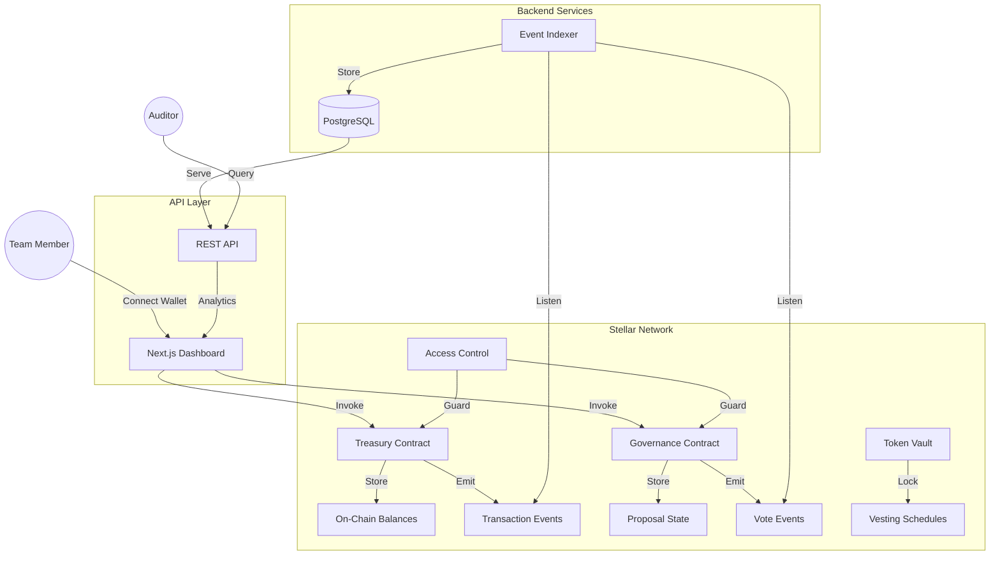

# StellarSentinel

A decentralized multi-signature treasury and DAO governance platform built on Stellar Soroban.

```
   _____ _            ____            _   _            _   _           _   
  / ____| |          / __ \___  _____| |_| |__   ___  | \ | | ___  ___| |_ 
 | (___ | | _____  _| |  | \ \/ / __| __| '_ \ / _ \ |  \| |/ _ \/ __| __|
  \___ \| |/ / _ \/ / |  | |>  < (__| |_| | | |  __/ | |\  |  __/\__ \ |_ 
  ____) |   <  __/ | |__| /_/\_\___|\__|_| |_|\___| |_| \_|\___||___/\__|
 |_____/|_|\_\___|_|\____/    /____/                                    
```

> Trustless treasury management for teams, DAOs, and community organizations.

---

## 💡 The Idea

StellarSentinel is a **sovereign, on-chain treasury management protocol** that enables:

- **Multi-Sig Fund Management**: Configurable approval thresholds for withdrawals (e.g., 3-of-5 signers)
- **DAO Governance**: Create and vote on proposals for fund allocation, policy changes, and membership
- **Token Vesting**: Lock tokens with time-based release schedules for team allocations
- **Role-Based Access**: Owner, Admin, Member, and Viewer permission tiers
- **Full Transparency**: Every action is recorded on-chain with event emissions

### Why This Matters

Many cooperatives, savings groups (ajo/esusu), and community organizations in emerging markets lack transparent treasury tools. StellarSentinel provides trustless, on-chain fund management with Stellar's low fees and fast finality — no bank account required.

---

## 🏗️ Architecture



---

## 🛠 Tech Stack

| Layer | Technology |
|-------|-----------|
| **Smart Contracts** | Soroban (Rust), `soroban-sdk` |
| **Frontend** | Next.js 14, TypeScript, Tailwind CSS |
| **Wallet** | Freighter Browser Extension |
| **Backend** | FastAPI (Python) or NestJS (TypeScript) |
| **Database** | PostgreSQL, Redis |
| **Indexing** | Custom Soroban-RPC event listener |
| **DevOps** | GitHub Actions, Docker Compose |

---

## 📦 Project Structure

```
stellar/
├── smartcontract/           # Soroban smart contracts (Rust)
│   ├── Cargo.toml           # Workspace root
│   └── contracts/
│       ├── treasury/        # Multi-sig treasury
│       ├── governance/      # Proposal & voting
│       ├── token-vault/     # Token locking & vesting
│       └── access-control/  # Role-based permissions
├── frontend/                # Next.js dashboard
│   └── src/
│       ├── app/             # Pages & routes
│       ├── components/      # UI components
│       ├── context/         # Wallet provider
│       ├── hooks/           # Data fetching hooks
│       └── lib/             # Soroban helpers
├── docs/                    # Issue trackers & guides
├── README.md
├── CONTRIBUTING.md
├── CODE_OF_CONDUCT.md
├── STYLE.md
└── MAINTAINERS.md
```

---

## 🚀 Getting Started

### 1. Prerequisites

- **Node.js** v18+
- **Rust** & Cargo (for smart contracts)
- **Soroban CLI** (`cargo install soroban-cli`)
- **Freighter Wallet** browser extension

### 2. Installation

Clone the repository:

```bash
git clone https://github.com/Stellar-Re-Code/StellarSentinel.git
cd StellarSentinel
```

Verify workspace integrity:

```bash
cargo build --all
```

Setup Smart Contracts:

```bash
cd smartcontract
# See docs/ISSUES-SMARTCONTRACT.md for contribution tasks
```

Setup Frontend:

```bash
cd frontend
npm install
npm run dev
# See docs/ISSUES-FRONTEND.md for contribution tasks
```

---

## 📚 Documentation & Trackers

We have separated our task lists for better organization. Please refer to the specific tracker for your area of contribution:

- 🧠 [Smart Contract Issues](docs/ISSUES-SMARTCONTRACT.md) — 25 issues
- 🎨 [Frontend Issues](docs/ISSUES-FRONTEND.md) — 25 issues
- ⚙️ [Backend & Indexer Issues](docs/ISSUES-BACKEND.md) — 12 issues
- 🔧 [DevOps Issues](docs/ISSUES-DEVOPS.md) — 8 issues

**Guides:**

- 📘 [Smart Contract Guide](docs/SMARTCONTRACT_GUIDE.md)
- 🌐 [Frontend Integration Guide](docs/FRONTEND_GUIDE.md)

---

## 🤝 Contributing

We welcome contributions! Please see our [CONTRIBUTING.md](CONTRIBUTING.md) for details on our code of conduct and the development process.

**Quick Start for Contributors:**

1. Pick an issue from `docs/`.
2. Fork the repo.
3. Create a feature branch (`feat/my-feature`).
4. Submit a PR!

---

## 📄 License

This project is licensed under the MIT License — see the [LICENSE](LICENSE) file for details.
